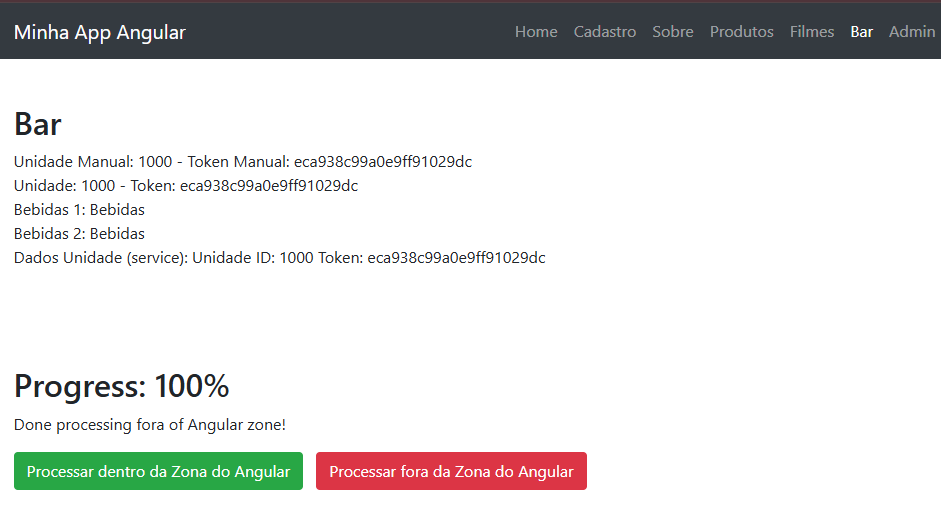

# DI e Zonas - Angular 19

Projeto de estudos utilizado no módulo **Injeção de Dependência (DI) e Zonas (ngZone)**, com o foco em compreender como funcionam os **Providers** e como o **NgZone** afeta o ciclo de detecção de mudanças no Angular 19.

---

## O que foi estudado
- Conceito de **Injeção de Dependência** no Angular.
- Como os Providers funcionam internamente.
- Diferença entre `useClass`, `useValue`, `useFactory` e `useExisting`.
- Uso de `Injection Tokens`.
- Funcionamento do `NgZone` e impacto na detecção de mudanças. 
- Como executar código dentro e fora da zona Angular.

---

## Estrutura principal do projeto
- `bar.component.html` >> 
    - Exibe as configurações injetadas, 
    - Mostra os resultados retornados pelos serviços, 
    - Apresenta o progresso (%) do exemplo com **NgZone**,
    - Comtém os botões para executar código dentro e fora da Angular Zone.   
- `bar.component.ts` >> 
    - Demonstra o uso dos providers: **useClass**, **useValue**, **useFactory** e **useExisting**, 
    - Injeta configurações usando tokens **ConfigManualUnidade** e **BAR_UNIDADE_CONFIG**,,
    - Consome os serviços **BarServices** e **BebidaService**,
    - Execução dentro e fora do Angular usando **NgZone** com um exemplo de progresso (%).
- `bar.config.ts` >> 
    - Define a interface de configuração **BarUnidadeConfig**,
    - Cria o InjectionToken **BAR_UNIDADE_CONFIG** usado para fornecer essas configurações no módulo e nos serviços.
- `bar.module.ts` >> 
    - Importa e exporta o **BarComponent**, 
    - Registra **provideHttpClient**,
    - Implementa o padrão **forRoot()** para fornecer configurações personalizadas usando tokens.
- `bar.service.ts` >>
    - BarFactory: factory utilizada pelo provider **useFactory**,
    - BarServices: serviço principal que utiliza **BAR_UNIDADE_CONFIG**,
    - BarServicesMock: **mock** simples para testes,
    - BebidaService: serviço abstrato usado com **useExisting**.

---

## Preview do projeto


## Tecnologias
- [Angular 19](https://angular.dev/)
- Typescript
- HTML / CSS

## Como executar
```
- npm install
- ng serve
- Acesse no navegador: http://localhost:4200
```
---

## Anotações importantes
- Esse conteúdo foi usado apenas como exemplo prático em aula.
- Serve como referência para futuras implementações de `DI` avançada e uso de NgZone.
- Importante observar como cada tipo de provider é adequado para cenários específicos.
- O uso correto de `NgZone` pode melhorar significativamente o desempenho em aplicações complexas.