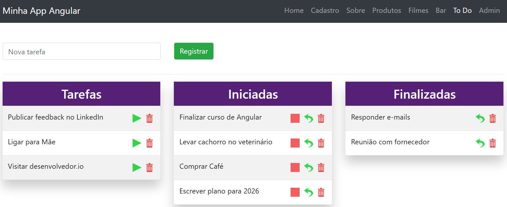

# Gerenciamento de estado com RxJS - Angular 19

> Projeto de estudos utilizado no módulo **Gerenciamento de estado com RxJS (State Management)**, com foco em compreender como usar Observables, Subjects, BehaviorSubjects e padrões reativos para controlar o estado global e local de componentes no Angular 19.

---

## O que foi estudado
- Conceito de fluxo reativo no frontend.
- Uso de Observable, Subject, BehaviorSubject, ReplaySubject.
- Padrão de state store simples usando RxJS.
- Gerenciamento de estado local e global.
- Diferença entre cold e hot observables.
- Estratégias para imutabilidade e atualização de estado.
- Como usar scan, map, tap, distinctUntilChanged, etc.
- Como expor estado para componentes.
- Como evitar problemas como múltiplas emissões não desejadas.

---

## Estrutura principal do projeto
- mock:
    - `api.json` >>
    - todo-list:
        - components: 
            - tasks:
                - `tasks.component.html` >> 
                - `tasks.component.ts` >> 
            - tasks-iniciadas:    
                - `tasks.iniciadas.html` >> 
                - `tasks.iniciadas.component.ts` >>
            - tasks-finalizadas:      
                - `tasks.finalizadas.html` >> 
                - `tasks.finalizadas.component.ts` >> 
            - todo-list:
                - `todo-list.component.css` >> 
                - `todo-list.component.html` >> 
                - `todo-list.component.ts` >> 
        - `task.ts` >>
        - `todo.component.html` >>
        - `todo.component.ts` >>
        - `todo.module.ts` >>
        - `todo.service.ts` >>
        - `todo.store.ts` >>
---

## Arquivo de dados (Mock API com json-server)
O projeto utiliza o json-server para simular uma API REST durante os estudos, permitindo realizar operações de GET, POST, PUT e DELETE sem a necessidade de um backend real.

O arquivo de dados está centralizado em um único arquivo JSON:
- Arquivo: `mock/api.json`
- Exemplo do conteúdo:
```
{
    "todolist": [
        {
            "id": 1,
            "nome": "Responder e-mails",
            "finalizado": false,
            "iniciado": true
        },
        {
            "id": 2,
            "nome": "Reunião com fornecedor",
            "finalizado": true,
            "iniciado": false
        },
        {
            "id": 3,
            "nome": "Finalizar curso de Angular",
            "finalizado": false,
            "iniciado": false
        }
    ]
}
```
A URL base da API é configurada via environment: `apiUrl: 'http://localhost:3000'`

> Observação importante:
- Os IDs são gerados automaticamente pelo json-server e possuem formato alfanumérico, simulando o comportamento de APIs reais modernas (UUID).
---

## Preview do projeto


## Tecnologias
- [Angular 19](https://angular.dev/)
- RxJS
- Typescript
- HTML / CSS

## Como executar
```
- npm install
- npm run dev
- Acesse no navegador: http://localhost:4200
```
---

## Anotações importantes
- Esse conteúdo mostra como implementar uma store simples sem NgRx.
- Útil como passo inicial para compreender padrões reativos.
- A abordagem com RxJS é leve e adequada para casos em que NgRx seria exagerado.
- Focar no entendimento profundo de subjects, streams e composição de operadores.
- Obs.: Ao final do projeto unifiquei todos os arquivos json-server em apenas um: api.json, configurando para subir o json-server e o Angular juntos, facilitando o ambiente de desenvolvimento.