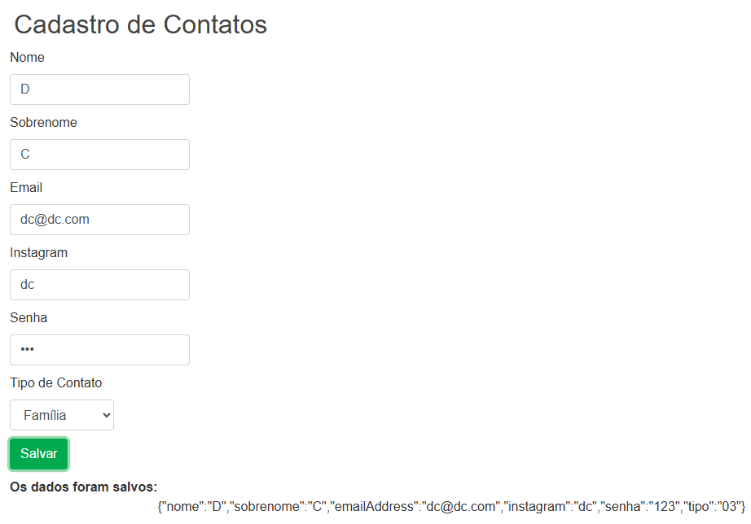

# Forms Dinâmicos - Angular 19

Projeto disponibilizado em aula, usado no módulo **Reactive Forms**, e o objetivo foi **estudar como criar formulários dinâmicos no Angular 19**, entendendo a estrutura e funcionamento do código.

---

## O que foi estudado
- Conceito de **Formulários Dinâmicos** em Angular.
- Uso de `FormGroup`, `FormControl` e `FormArray`.
- Criação de componentes genéricos para renderizar diferentes tipos de campos (`textbox`, `dropdown` etc.).
- Separação de responsabilidades usando `question.service.ts` e `question-base.ts`.
- Como carregar um formulário a partir de **configurações JSON**.
- Aplicação de **validações dinâmicas**.

---

## Estrutura principal do projeto
- `app.component.ts` >> ponto inicial da aplicação.  
- `dynamic-form.component.ts` >> Componente que renderiza o formulário inteiro.
- `dynamic-form-question.component.ts` >> Componente que exibe os campos dinamicamente.
- `question-base.ts` >> Classe base para diferentes tipos de perguntas.
- `question-dropdown.ts` >> Campo do tipo **select**.
- `question-textbox.ts` >> Campo do tipo **input text**.
- `question-control.service.ts` >> Constrói dinamicamente o `FormGroup`.
- `question.service.ts` >> Define a lista de perguntas/campos a serem exibidos.

---

## Preview do projeto


## Tecnologias
- [Angular 19](https://angular.dev/)
- Typescript
- HTML / CSS

## Como executar
```bash```
- npm install
- ng serve
- Acesse no navegador: http://localhost:4200

---

## Anotações importantes
- Esse código foi usado apenas como exemplo prático em aula.
- Serve como referência para futuras implementações de formulários dinâmicos em projetos reais.
- Importante observar como os componentes são genéricos e reutilizáveis, permitindo criar qualquer formulário apenas alterando o JSON de configuração.
